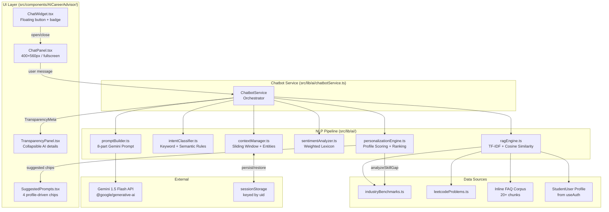
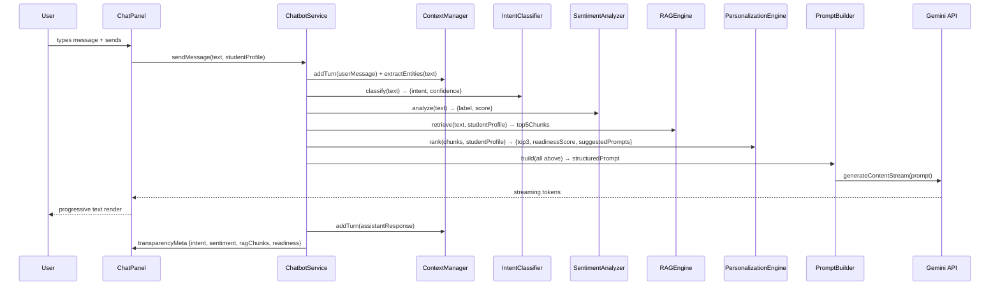

# Design Document: AI Career Advisor Chatbot

## Overview

The AI Career Advisor Chatbot is a floating widget embedded in the Campus2Career student portal. It provides personalized, context-aware career guidance by running a multi-layer local NLP pipeline before each Gemini 1.5 Flash call. All NLP processing happens client-side with no new npm packages — the system reuses `@google/generative-ai`, `src/lib/skillGapAnalysis.ts`, `src/data/industryBenchmarks.ts`, and `src/data/leetcodeProblems.ts` already present in the project.

The widget is code-split via `React.lazy` and mounted in `src/App.tsx` on all seven `requireAssessment` student routes. It persists conversation state to `sessionStorage` keyed by student `uid` so the chat is continuous across page navigations within a session.

### Key Design Decisions

- **No new npm packages**: TF-IDF, cosine similarity, intent classification, and sentiment analysis are all implemented from scratch in TypeScript using only browser APIs.
- **Client-side RAG**: The knowledge base is built in memory at initialization time from static data files + the student's Firestore profile. No server-side vector store is needed.
- **Streaming responses**: The `@google/generative-ai` SDK's `generateContentStream` is used so tokens appear progressively in the UI.
- **Graceful degradation**: A 15-second timeout triggers a local fallback response built from the top RAG chunk, keeping the widget usable when Gemini is unavailable.
- **sessionStorage only**: Conversation history is never written to Firestore to avoid read/write costs.

---

## Architecture



### Data Flow per User Message



---

## Components and Interfaces

### UI Components (`src/components/AICareerAdvisor/`)

#### `ChatWidget.tsx`
The outermost shell. Fixed `bottom-6 right-6` with `z-50`. Manages the collapsed/expanded toggle state.

```typescript
interface ChatWidgetProps {
  student: StudentUser;
}

interface ChatWidgetState {
  isOpen: boolean;
  unreadCount: number;
}
```

Renders a circular `<button aria-label="Open AI Career Advisor">` with a Lucide `Bot` icon and an unread badge when `unreadCount > 0`. Clicking toggles `isOpen` which mounts/unmounts `ChatPanel`.

#### `ChatPanel.tsx`
The main chat interface. Dimensions: `w-[400px] h-[560px]`, full-screen: `max-w-[800px] w-full h-full`. Has `role="dialog"` and `aria-label="AI Career Advisor Chat"`.

```typescript
interface ChatPanelProps {
  student: StudentUser;
  onClose: () => void;
  onUnreadChange: (count: number) => void;
}

interface Message {
  id: string;
  role: 'user' | 'assistant';
  content: string;
  timestamp: number;
  transparencyMeta?: TransparencyMeta;
  isStreaming?: boolean;
}

interface ChatPanelState {
  messages: Message[];
  inputValue: string;
  isLoading: boolean;
  isFullScreen: boolean;
}
```

Manages the message list, input field, and calls `ChatbotService.sendMessage`. Renders `SuggestedPrompts` when the message list is empty or after each response. Renders `TransparencyPanel` per assistant message.

#### `TransparencyPanel.tsx`
Collapsible inline panel below each assistant message.

```typescript
interface TransparencyMeta {
  intent: Intent;
  intentConfidence: number;
  sentimentLabel: SentimentLabel;
  sentimentScore: number;
  ragChunksRetrieved: number;
  topChunkTitle: string;
  placementReadinessScore: number;
  modelUsed: 'gemini-1.5-flash' | 'local-fallback';
}

interface TransparencyPanelProps {
  meta: TransparencyMeta;
  defaultExpanded?: boolean;
}
```

Toggled by a "Show AI Details" button. Styled with `bg-muted/50 text-xs rounded-lg p-3 mt-2`.

#### `SuggestedPrompts.tsx`
Four chip buttons generated by `PersonalizationEngine`.

```typescript
interface SuggestedPromptsProps {
  prompts: string[];
  onSelect: (prompt: string) => void;
}
```

---

### AI Module Interfaces (`src/lib/ai/`)

#### `ragEngine.ts`

```typescript
export interface KnowledgeChunk {
  id: string;
  title: string;
  content: string;
  source: 'industry_benchmark' | 'leetcode' | 'faq' | 'student_profile';
  tags: string[];           // role names, skill names, topic tags
  tfidfVector: Map<string, number>;  // term → tf-idf weight
}

export interface RAGResult {
  chunks: KnowledgeChunk[];
  queryVector: Map<string, number>;
}

export interface RAGEngine {
  initialize(student: StudentUser): Promise<void>;
  refreshProfileChunks(student: StudentUser): void;
  retrieve(query: string, topK?: number): RAGResult;
  isInitialized(): boolean;
}
```

#### `intentClassifier.ts`

```typescript
export type Intent =
  | 'skill_gap_query'
  | 'interview_prep'
  | 'company_info'
  | 'placement_advice'
  | 'resume_help'
  | 'leetcode_guidance';

export interface IntentResult {
  intent: Intent;
  confidence: number;   // 0.0 – 1.0
  matchedKeywords: string[];
}

export interface IntentClassifier {
  classify(message: string): IntentResult;
}
```

#### `contextManager.ts`

```typescript
export interface ConversationTurn {
  role: 'user' | 'assistant';
  content: string;
  timestamp: number;
}

export interface ExtractedEntities {
  companies: string[];
  roles: string[];
  skills: string[];
}

export interface ContextSnapshot {
  turns: ConversationTurn[];
  entities: ExtractedEntities;
}

export interface ContextManager {
  addTurn(turn: ConversationTurn): void;
  extractEntities(text: string): ExtractedEntities;
  getSnapshot(): ContextSnapshot;
  persist(uid: string): void;
  restore(uid: string): boolean;
  clear(uid: string): void;
}
```

#### `sentimentAnalyzer.ts`

```typescript
export type SentimentLabel = 'stressed' | 'neutral' | 'confident';

export interface SentimentResult {
  label: SentimentLabel;
  score: number;   // negative = stressed, 0 = neutral, positive = confident
  matchedTerms: string[];
}

export interface SentimentAnalyzer {
  analyze(message: string): SentimentResult;
}
```

#### `personalizationEngine.ts`

```typescript
export interface RankedChunk {
  chunk: KnowledgeChunk;
  combinedScore: number;   // 0.6 × cosine + 0.4 × profileRelevance
  cosineScore: number;
  profileScore: number;
}

export interface PersonalizationResult {
  rankedChunks: RankedChunk[];
  readinessScore: number;   // 0–100 from analyzeSkillGap
  suggestedPrompts: string[];
}

export interface PersonalizationEngine {
  rank(
    ragResult: RAGResult,
    student: StudentUser,
    intent: Intent
  ): PersonalizationResult;
}
```

#### `promptBuilder.ts`

```typescript
export interface PromptInput {
  student: StudentUser;
  ragResult: RAGResult;
  intent: IntentResult;
  sentiment: SentimentResult;
  personalization: PersonalizationResult;
  context: ContextSnapshot;
  userMessage: string;
}

export interface PromptBuilder {
  build(input: PromptInput): string;
  estimateTokens(text: string): number;
}
```

#### `chatbotService.ts`

```typescript
export interface ChatbotResponse {
  stream: AsyncIterable<string>;   // token chunks
  transparencyMeta: TransparencyMeta;
  suggestedPrompts: string[];
}

export interface ChatbotService {
  initialize(student: StudentUser): Promise<void>;
  sendMessage(
    message: string,
    student: StudentUser
  ): Promise<ChatbotResponse>;
  clearSession(uid: string): void;
}
```

---

## Data Models

### TF-IDF Vector Computation

The RAG engine builds an in-memory inverted index over all chunks at initialization time.

**Step 1 — Tokenization and normalization:**
```
tokens = text.toLowerCase()
             .replace(/[^a-z0-9\s]/g, ' ')
             .split(/\s+/)
             .filter(t => t.length > 2 && !STOP_WORDS.has(t))
```

**Step 2 — Term Frequency (TF) per chunk:**
```
TF(term, chunk) = count(term in chunk.tokens) / chunk.tokens.length
```

**Step 3 — Inverse Document Frequency (IDF) over corpus:**
```
IDF(term) = ln( (1 + N) / (1 + df(term)) ) + 1
```
where `N` = total number of chunks, `df(term)` = number of chunks containing the term. The `+1` smoothing prevents zero-division and reduces the penalty for very common terms.

**Step 4 — TF-IDF weight:**
```
TFIDF(term, chunk) = TF(term, chunk) × IDF(term)
```

Each chunk's vector is L2-normalized after computation so cosine similarity reduces to a dot product:
```
||v|| = sqrt(sum(w² for w in vector.values()))
normalizedWeight(term) = TFIDF(term, chunk) / ||v||
```

**Step 5 — Query vector:**
The user's query is tokenized and weighted using the same IDF table (terms not in the corpus get IDF = 1). The query vector is also L2-normalized.

**Step 6 — Cosine similarity:**
```
cosine(query, chunk) = sum( queryWeight(t) × chunkWeight(t) for t in intersection )
```
Because both vectors are L2-normalized this is equivalent to the dot product. Top-5 chunks by descending cosine score are returned.

### Knowledge Base Corpus Structure

| Source | Chunk count | Chunk content |
|---|---|---|
| `industryBenchmarks.ts` | 6 (one per role) | Role name, required skills list, LeetCode/project/internship benchmarks, salary range |
| `leetcodeProblems.ts` | 28 (one per problem) | Problem title, difficulty, category, target year level |
| Placement FAQs | 20+ | Q&A pairs covering placement process, eligibility, interview tips, offer negotiation |
| Student profile | 5–8 | Skills chunk, projects chunk, internships chunk, goals/interests chunk, LeetCode stats chunk |

Total corpus: ~60–70 chunks. Initialization time is well under 500ms on modern browsers.

### Intent Classifier Keyword Dictionary

Two-stage classification: keyword pass first, then semantic rule pass.

**Stage 1 — Keyword dictionary (per intent):**

```typescript
const INTENT_KEYWORDS: Record<Intent, string[]> = {
  skill_gap_query: [
    'skill', 'gap', 'missing', 'lack', 'need to learn', 'what should i learn',
    'improve', 'weak', 'not good at', 'skills required', 'technology', 'tech stack'
  ],
  interview_prep: [
    'interview', 'prepare', 'preparation', 'mock', 'question', 'answer',
    'hr round', 'technical round', 'coding round', 'behavioral', 'system design'
  ],
  company_info: [
    'company', 'google', 'amazon', 'microsoft', 'flipkart', 'infosys', 'tcs',
    'wipro', 'accenture', 'startup', 'mnc', 'package', 'salary', 'ctc', 'offer'
  ],
  placement_advice: [
    'placement', 'placed', 'campus', 'drive', 'eligible', 'criteria', 'shortlist',
    'resume', 'apply', 'job', 'career', 'advice', 'tips', 'strategy', 'plan'
  ],
  resume_help: [
    'resume', 'cv', 'ats', 'format', 'template', 'write', 'update', 'improve resume',
    'projects section', 'experience', 'summary', 'objective', 'keywords'
  ],
  leetcode_guidance: [
    'leetcode', 'dsa', 'data structure', 'algorithm', 'coding', 'problem',
    'array', 'tree', 'graph', 'dp', 'dynamic programming', 'solve', 'practice'
  ]
};
```

**Keyword scoring:**
```
keywordScore(intent, message) = matchedKeywords.length / INTENT_KEYWORDS[intent].length
```

**Stage 2 — Semantic rules (phrase patterns):**

```typescript
const SEMANTIC_RULES: Array<{ pattern: RegExp; intent: Intent; boost: number }> = [
  { pattern: /what (skills?|tech) (do i|should i|must i)/i, intent: 'skill_gap_query', boost: 0.4 },
  { pattern: /how (to|do i) (prepare|crack|pass) (interview|round)/i, intent: 'interview_prep', boost: 0.4 },
  { pattern: /which (company|companies|firm)/i, intent: 'company_info', boost: 0.3 },
  { pattern: /am i (eligible|ready|prepared)/i, intent: 'placement_advice', boost: 0.35 },
  { pattern: /how (to|should i) (write|improve|update|fix) (my )?(resume|cv)/i, intent: 'resume_help', boost: 0.4 },
  { pattern: /which (leetcode|dsa|problems?) (should i|to|must i)/i, intent: 'leetcode_guidance', boost: 0.4 },
];
```

**Final confidence score:**
```
confidence(intent) = keywordScore(intent) + semanticBoost(intent)
classified intent = argmax(confidence) if max(confidence) >= 0.3 else 'placement_advice'
```

### Sentiment Lexicon

```typescript
const STRESS_TERMS: Array<{ term: string; weight: number }> = [
  { term: 'worried', weight: 1.0 },
  { term: 'anxious', weight: 1.0 },
  { term: 'scared', weight: 1.0 },
  { term: 'failing', weight: 1.2 },
  { term: 'failed', weight: 1.2 },
  { term: 'rejected', weight: 1.2 },
  { term: 'rejection', weight: 1.0 },
  { term: 'nervous', weight: 0.8 },
  { term: 'stressed', weight: 1.0 },
  { term: 'overwhelmed', weight: 1.0 },
  { term: 'behind', weight: 0.7 },
  { term: 'not ready', weight: 1.1 },
  { term: 'unprepared', weight: 1.1 },
  { term: 'hopeless', weight: 1.3 },
  { term: 'lost', weight: 0.8 },
  { term: 'confused', weight: 0.6 },
  { term: 'struggling', weight: 0.9 },
  { term: 'can\'t', weight: 0.5 },
  { term: 'impossible', weight: 1.0 },
  { term: 'terrible', weight: 1.0 },
  { term: 'bad at', weight: 0.9 },
  { term: 'weak', weight: 0.7 },
  { term: 'no chance', weight: 1.2 },
  { term: 'give up', weight: 1.3 },
  { term: 'demotivated', weight: 1.0 },
  { term: 'depressed', weight: 1.2 },
  { term: 'doubt', weight: 0.6 },
  { term: 'fear', weight: 0.8 },
  { term: 'panic', weight: 1.0 },
  { term: 'disaster', weight: 1.1 },
  { term: 'terrible', weight: 1.0 },
  { term: 'horrible', weight: 1.0 },
];

const CONFIDENCE_TERMS: Array<{ term: string; weight: number }> = [
  { term: 'ready', weight: 1.0 },
  { term: 'confident', weight: 1.0 },
  { term: 'excited', weight: 0.9 },
  { term: 'prepared', weight: 1.0 },
  { term: 'strong', weight: 0.8 },
  { term: 'good at', weight: 0.9 },
  { term: 'skilled', weight: 0.9 },
  { term: 'experienced', weight: 0.8 },
  { term: 'motivated', weight: 0.9 },
  { term: 'optimistic', weight: 0.8 },
  { term: 'improving', weight: 0.7 },
  { term: 'progressing', weight: 0.7 },
  { term: 'achieved', weight: 0.9 },
  { term: 'completed', weight: 0.7 },
  { term: 'mastered', weight: 1.0 },
  { term: 'love', weight: 0.6 },
  { term: 'enjoy', weight: 0.6 },
  { term: 'passionate', weight: 0.9 },
  { term: 'determined', weight: 0.9 },
  { term: 'focused', weight: 0.8 },
];
```

**Scoring:**
```
rawScore = sum(weight for matched confidence terms) - sum(weight for matched stress terms)
label = rawScore < -0.5 → 'stressed'
      | rawScore > 0.5  → 'confident'
      | otherwise       → 'neutral'
```

### Personalization Scoring Formula

**Combined chunk score:**
```
combinedScore(chunk) = 0.6 × cosineScore(chunk) + 0.4 × profileRelevance(chunk)
```

**Profile relevance score:**
```
profileRelevance(chunk) = tagOverlap(chunk.tags, studentCareerTrackSkills) / max(chunk.tags.length, 1)
```
where `studentCareerTrackSkills` = the union of the student's `skills`, `techSkills`, and the required skills of their `careerTrack` benchmark.

**Year-based filtering:**
- `currentYear` 1–2: chunks with `source === 'industry_benchmark'` and tags matching foundational skills get a `+0.15` boost; placement-readiness FAQ chunks get a `-0.2` penalty.
- `currentYear` 3–4: internship and system design chunks get a `+0.15` boost.
- `placementStatus === 'placed'`: chunks tagged with `placement_drive` or `eligibility` are excluded from ranking.

**Placement readiness score:**
Delegates directly to `analyzeSkillGap(skills, careerTrack, leetcodeSolved, projectCount, internshipCount, cgpa)` from `src/lib/skillGapAnalysis.ts`. Returns `overallReadiness` (0–100).

### Prompt Template Structure

The `PromptBuilder` assembles an 8-part prompt. Token budget is 8000; oldest sliding-window turns are truncated first if the budget is exceeded.

```
[PART 1 — SYSTEM PERSONA]
You are an expert AI Career Advisor for Campus2Career, a placement management system.
Your role is to give personalized, actionable career guidance to engineering students.
Be specific, cite data from the student's profile, and always suggest concrete next steps.

[PART 2 — TONE INSTRUCTION]
(injected based on SentimentLabel)
stressed  → "The student seems anxious. Lead with encouragement. Acknowledge their effort before listing gaps."
confident → "The student is confident. Be direct and ambitious. Suggest stretch goals."
neutral   → "Use a balanced, professional tone."

[PART 3 — STUDENT PROFILE SUMMARY]
Name: {name} | Year: {currentYear} | Branch: {branch}
Career Track: {careerTrack} | CGPA: {cgpa} | Placement Status: {placementStatus}
Skills: {skills.join(', ')}
LeetCode Solved: {leetcodeStats.totalSolved}
Projects: {projects.length} | Internships: {internships.length}
Goals: {goals.join(', ')}

[PART 4 — RETRIEVED CONTEXT (top 5 RAG chunks)]
--- Context 1: {chunk.title} ---
{chunk.content}
...

[PART 5 — CLASSIFIED INTENT]
The student's query intent is: {intent} (confidence: {confidence})
Focus your answer on this intent category.

[PART 6 — PERSONALIZATION RATIONALE]
Placement Readiness Score: {readinessScore}/100
Top advice focus areas: {rankedChunks[0..2].map(c => c.chunk.title).join(', ')}

[PART 7 — CONVERSATION HISTORY]
{turns.map(t => `${t.role === 'user' ? 'Student' : 'Advisor'}: ${t.content}`).join('\n')}

[PART 8 — CURRENT QUESTION]
Student: {userMessage}
Advisor:
```

### sessionStorage Schema

Key format: `c2c_chat_{uid}`

```typescript
interface PersistedSession {
  version: 1;
  uid: string;
  turns: ConversationTurn[];      // max 10
  entities: ExtractedEntities;
  lastUpdated: number;            // Date.now()
}
```

Serialized as JSON. On restore, the version field is checked; mismatched versions are discarded and a fresh session starts.

---

## Correctness Properties

*A property is a characteristic or behavior that should hold true across all valid executions of a system — essentially, a formal statement about what the system should do. Properties serve as the bridge between human-readable specifications and machine-verifiable correctness guarantees.*


### Property 1: RAG Corpus Completeness

*For any* initialized RAG engine with a valid student profile, the knowledge base must contain at least one chunk from each of the four required sources: `industry_benchmark`, `leetcode`, `faq`, and `student_profile`.

**Validates: Requirements 1.1, 1.5**

---

### Property 2: TF-IDF Vector Validity

*For any* chunk in an initialized knowledge base, its `tfidfVector` must be non-empty and every weight value must be strictly positive (> 0).

**Validates: Requirements 1.2**

---

### Property 3: Retrieval Ordering

*For any* query string against an initialized knowledge base with at least 5 chunks, the `retrieve()` method must return exactly 5 chunks whose cosine similarity scores are in monotonically non-increasing order (i.e., `scores[i] >= scores[i+1]` for all i).

**Validates: Requirements 1.3**

---

### Property 4: Profile Chunk Refresh

*For any* student profile update, after calling `refreshProfileChunks(newProfile)`, the knowledge base must contain chunks reflecting the new profile data and must not contain chunks from the old profile that have been superseded.

**Validates: Requirements 1.6**

---

### Property 5: Intent Classification Completeness

*For any* string input, `classify()` must return an `IntentResult` where `intent` is one of the six valid `Intent` values and `confidence` is a number in the range [0.0, 1.0].

**Validates: Requirements 2.1, 2.4**

---

### Property 6: Sliding Window Size Invariant

*For any* sequence of N conversation turns added to the context manager (where N > 10), `getSnapshot().turns.length` must equal exactly 10, and the turns present must be the N most recently added turns.

**Validates: Requirements 3.1, 3.2**

---

### Property 7: Entity Extraction Coverage

*For any* message string containing a term that appears in the entity dictionary (companies, roles, or skills), `extractEntities()` must include that term in the corresponding entity array of the result.

**Validates: Requirements 3.3**

---

### Property 8: Entity Accumulation Monotonicity

*For any* sequence of turns added to the context manager, the entity set in `getSnapshot().entities` must be a superset of the entity set from any earlier snapshot — entities are never removed during a session.

**Validates: Requirements 3.4**

---

### Property 9: Context Session Round-Trip

*For any* context snapshot (turns + entities), calling `persist(uid)` followed by `restore(uid)` on a fresh context manager instance must produce a snapshot that is structurally equivalent to the original (same turns in same order, same entity sets).

**Validates: Requirements 3.6, 10.1, 10.2**

---

### Property 10: Sentiment Label Validity

*For any* string input, `analyze()` must return a `SentimentResult` where `label` is exactly one of `'stressed'`, `'neutral'`, or `'confident'`, and `score` is a finite number.

**Validates: Requirements 4.2**

---

### Property 11: Tone Instruction Injection

*For any* `PromptInput`, the prompt built by `PromptBuilder.build()` must contain a tone instruction string that corresponds to the `sentiment.label`: empathetic/encouraging language for `'stressed'`, direct/ambitious language for `'confident'`, and balanced/professional language for `'neutral'`.

**Validates: Requirements 4.3, 4.4, 4.5**

---

### Property 12: Readiness Score Range

*For any* valid `StudentUser` profile, `PersonalizationEngine.rank()` must return a `readinessScore` in the closed interval [0, 100].

**Validates: Requirements 5.1**

---

### Property 13: Combined Scoring Formula Invariant

*For any* set of RAG chunks and student profile, each `RankedChunk` in the personalization result must satisfy: `|combinedScore - (0.6 × cosineScore + 0.4 × profileScore)| < 0.001` (floating-point tolerance).

**Validates: Requirements 5.2**

---

### Property 14: Year-Aware Chunk Ranking

*For any* student with `currentYear` 1 or 2, foundational skill chunks must appear ranked higher than placement-readiness FAQ chunks in the personalization result, all else being equal. *For any* student with `currentYear` 3 or 4, internship and system design chunks must rank higher than foundational skill chunks, all else being equal.

**Validates: Requirements 5.3, 5.4**

---

### Property 15: Placed Student Filtering

*For any* student with `placementStatus === 'placed'`, no chunk tagged with `placement_drive` or `eligibility` must appear in the `rankedChunks` output of `PersonalizationEngine.rank()`.

**Validates: Requirements 5.5**

---

### Property 16: Prompt Structure Completeness

*For any* valid `PromptInput`, the string returned by `PromptBuilder.build()` must contain all 8 structural sections: system persona, tone instruction, student profile summary, retrieved context chunks, classified intent, personalization rationale, conversation history, and current user message.

**Validates: Requirements 6.1**

---

### Property 17: Token Limit Enforcement

*For any* `PromptInput` whose naive assembly would exceed 8000 tokens, `PromptBuilder.build()` must return a prompt whose estimated token count is ≤ 8000, achieved by truncating the oldest sliding-window turns first.

**Validates: Requirements 6.5**

---

### Property 18: LeetCode Intent Context Injection

*For any* `PromptInput` where `intent.intent === 'leetcode_guidance'`, the built prompt must contain problem entries from `RECOMMENDED_PROBLEMS` filtered to include only problems whose `level` matches the student's `currentYear` (or `level <= currentYear`).

**Validates: Requirements 6.6**

---

### Property 19: Welcome Message Personalization

*For any* `StudentUser` profile, the welcome message generated on first chat open must contain the student's `name` and `careerTrack` as substrings.

**Validates: Requirements 7.7**

---

### Property 20: Transparency Meta Completeness

*For any* assistant response message, its `transparencyMeta` must be non-null and must contain all required fields with valid values: `intent` (valid Intent), `intentConfidence` (0–1), `sentimentLabel` (valid SentimentLabel), `sentimentScore` (finite number), `ragChunksRetrieved` (positive integer), `topChunkTitle` (non-empty string), `placementReadinessScore` (0–100), and `modelUsed` (valid model label).

**Validates: Requirements 8.1, 8.2**

---

### Property 21: Suggested Prompts Count

*For any* `StudentUser` profile, `PersonalizationEngine.rank()` must return exactly 4 strings in `suggestedPrompts`.

**Validates: Requirements 9.1**

---

### Property 22: Year-4 Unplaced Placement Prompt

*For any* student with `currentYear === 4` and `placementStatus !== 'placed'`, at least one of the 4 strings in `suggestedPrompts` must contain a placement-readiness related keyword (e.g., "placement", "ready", "drive", "eligible", "assessment").

**Validates: Requirements 9.4**

---

## Error Handling

### Gemini API Failures

| Failure Mode | Detection | Response |
|---|---|---|
| Network timeout (>15s) | `Promise.race` with a 15s timeout | Return local fallback from top RAG chunk |
| API key missing/invalid | `GoogleGenerativeAI` throws on init | Show error message in chat, disable send button |
| Rate limit (429) | HTTP status check on stream | Show "Try again in a moment" message |
| Malformed stream | Try/catch around stream iteration | Flush partial content + show warning |

**Fallback message construction:**
```typescript
function buildFallbackResponse(topChunk: KnowledgeChunk): string {
  return `Based on available information about ${topChunk.title}: ${topChunk.content.slice(0, 400)}... 
  (Note: AI generation is temporarily unavailable. This is a summary from our knowledge base.)`;
}
```

### sessionStorage Failures

The `ContextManager` wraps all `sessionStorage` calls in try/catch. If `sessionStorage` is unavailable (private browsing restrictions, storage quota exceeded), the manager silently falls back to in-memory-only operation. No error is surfaced to the user.

```typescript
function safePersist(key: string, data: PersistedSession): void {
  try {
    sessionStorage.setItem(key, JSON.stringify(data));
  } catch {
    // silent fallback — in-memory state is still valid
  }
}
```

### RAG Initialization Failures

If `industryBenchmarks` or `leetcodeProblems` data is malformed, the RAG engine logs a warning and continues with whatever chunks were successfully parsed. The FAQ corpus is hardcoded inline so it cannot fail. The student profile chunks are built defensively — missing fields produce empty chunks rather than throwing.

### Intent Classification Edge Cases

- Empty string input → returns `{ intent: 'placement_advice', confidence: 0 }`
- Very long input (>1000 chars) → truncated to first 500 chars before classification to stay within 50ms budget
- Non-English input → keyword matching will likely score 0 on all intents → fallback to `placement_advice`

---

## Testing Strategy

### Dual Testing Approach

Both unit tests and property-based tests are required. They are complementary:
- Unit tests verify specific examples, integration points, and error conditions
- Property tests verify universal correctness across randomized inputs

### Property-Based Testing Library

Use **fast-check** — it is already a dev dependency in most Vite/TypeScript projects and has zero runtime footprint. If not present, it can be added as a dev-only dependency (no runtime impact).

Each property test runs a minimum of **100 iterations** (fast-check default). Configure via:
```typescript
fc.assert(fc.property(...), { numRuns: 100 });
```

### Property Test Mapping

Each correctness property maps to exactly one property-based test:

| Property | Test description | fast-check arbitraries |
|---|---|---|
| P1: RAG Corpus Completeness | Initialize with random student profile, check source coverage | `fc.record({ skills: fc.array(fc.string()), ... })` |
| P2: TF-IDF Vector Validity | Random corpus of strings, check all weights > 0 | `fc.array(fc.string({ minLength: 10 }), { minLength: 5 })` |
| P3: Retrieval Ordering | Random query + corpus, check descending scores | `fc.string()` + random chunk array |
| P4: Profile Chunk Refresh | Two random profiles, refresh, check new chunks present | Two `fc.record(StudentUser shape)` |
| P5: Intent Classification Completeness | Any string → valid intent + confidence in [0,1] | `fc.string()` |
| P6: Sliding Window Size Invariant | N > 10 random turns, check length = 10 | `fc.array(fc.record(...), { minLength: 11, maxLength: 30 })` |
| P7: Entity Extraction Coverage | Message containing known entity, check extraction | `fc.constantFrom(...entityDictionary)` embedded in `fc.string()` |
| P8: Entity Accumulation Monotonicity | Sequence of turns, check entity set grows monotonically | `fc.array(fc.record({ role, content }))` |
| P9: Context Round-Trip | Random snapshot, persist + restore, check equivalence | `fc.record(ContextSnapshot shape)` |
| P10: Sentiment Label Validity | Any string → valid label + finite score | `fc.string()` |
| P11: Tone Instruction Injection | Random PromptInput with each sentiment, check prompt contains tone | `fc.constantFrom('stressed', 'neutral', 'confident')` |
| P12: Readiness Score Range | Random student profile → score in [0, 100] | `fc.record(StudentUser shape)` |
| P13: Combined Scoring Formula | Random chunks + profile, check formula holds | `fc.array(fc.record({ cosineScore, profileScore }))` |
| P14: Year-Aware Ranking | Year 1-2 vs 3-4 profiles, check relative chunk ordering | `fc.integer({ min: 1, max: 4 })` |
| P15: Placed Student Filtering | Placed student profile, check no placement_drive chunks | `fc.record({ placementStatus: fc.constant('placed'), ... })` |
| P16: Prompt Structure Completeness | Random PromptInput, check all 8 sections present | `fc.record(PromptInput shape)` |
| P17: Token Limit Enforcement | PromptInput with many long turns, check ≤ 8000 tokens | `fc.array(fc.string({ minLength: 200 }), { minLength: 20 })` |
| P18: LeetCode Intent Context | leetcode_guidance intent + year, check filtered problems | `fc.integer({ min: 1, max: 4 })` |
| P19: Welcome Message Personalization | Random student profile, check name + careerTrack in welcome | `fc.record({ name: fc.string(), careerTrack: fc.string() })` |
| P20: Transparency Meta Completeness | Any chatbot response, check all meta fields valid | Integration test with mocked Gemini |
| P21: Suggested Prompts Count | Any student profile → exactly 4 prompts | `fc.record(StudentUser shape)` |
| P22: Year-4 Placement Prompt | Year-4 unplaced student → at least 1 placement prompt | `fc.record({ currentYear: fc.constant(4), placementStatus: fc.string().filter(s => s !== 'placed') })` |

### Tag Format

Each property test must include a comment tag:
```typescript
// Feature: ai-career-advisor-chatbot, Property 1: RAG corpus completeness
```

### Unit Test Coverage

Unit tests focus on:
- **Specific examples**: Known query → expected top chunk (e.g., "leetcode arrays" → Arrays chunk)
- **Error conditions**: API timeout → fallback response returned; sessionStorage unavailable → no throw
- **Integration points**: `ChatbotService.sendMessage` with mocked Gemini → correct `TransparencyMeta` shape
- **Accessibility**: Rendered `ChatWidget` has correct `aria-label`; `ChatPanel` has `role="dialog"`
- **Edge cases**: Empty message input rejected; 11th turn evicts oldest; `placementStatus === 'placed'` filters drive chunks

### Test File Structure

```
src/
  lib/
    ai/
      __tests__/
        ragEngine.test.ts          # P1, P2, P3, P4 + unit examples
        intentClassifier.test.ts   # P5 + unit examples
        contextManager.test.ts     # P6, P7, P8, P9 + unit examples
        sentimentAnalyzer.test.ts  # P10 + unit examples
        personalizationEngine.test.ts  # P11, P12, P13, P14, P15, P21, P22
        promptBuilder.test.ts      # P16, P17, P18, P19
  components/
    AICareerAdvisor/
      __tests__/
        ChatWidget.test.tsx        # Accessibility, collapsed/expanded state
        ChatPanel.test.tsx         # P20, welcome message, clear chat
        TransparencyPanel.test.tsx # Expand/collapse toggle
```

### Performance Considerations

- **RAG initialization**: Runs in a `useEffect` with `setTimeout(..., 0)` to yield to the UI thread. The ~60-chunk corpus with TF-IDF computation completes in <100ms on modern hardware, well within the 500ms budget.
- **Intent classification**: Pure string operations on a small keyword dictionary. Consistently <5ms, well within the 50ms budget.
- **Sentiment analysis**: Single-pass string scan. <1ms for typical messages.
- **Prompt building**: String concatenation with token estimation (character count / 4). <10ms.
- **Streaming**: Tokens are appended to the message content in `useState` updates. React 19's concurrent rendering batches these efficiently.
- **Code splitting**: `React.lazy(() => import('./components/AICareerAdvisor/ChatWidget'))` ensures the entire AI pipeline is excluded from the initial bundle. The lazy chunk loads only when a student navigates to a `requireAssessment` route.
