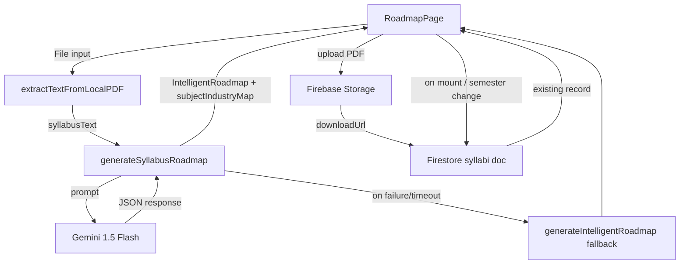

# Design Document: Syllabus-Driven AI Roadmap

## Overview

This feature replaces the hardcoded NMIMS curriculum data in `RoadmapPage.tsx` with a real Gemini AI pipeline. Students select a semester, upload their syllabus PDF, and receive a personalized roadmap generated by Gemini 1.5 Flash. The AI maps each syllabus subject to industry relevance and supplementary skills. Uploaded syllabi are persisted in Firebase Storage so students never re-upload on repeat visits. An algorithmic fallback (`generateIntelligentRoadmap`) is retained for when Gemini is unavailable or the API key is absent. The "AI-Powered" label is made honest: it only appears when Gemini actually ran.

### Key Design Decisions

- **Direct Gemini call from frontend**: No backend proxy. The existing pattern in `gemini.ts` (`analyzeProfileWithAI`) already calls Gemini directly from the browser using `VITE_GEMINI_API_KEY`. We follow the same pattern.
- **Extend `IntelligentRoadmap` rather than create a new type**: `RoadmapPage` already consumes `IntelligentRoadmap`. Adding an optional `subjectIndustryMap` field keeps the fallback path zero-change.
- **Firestore document per semester**: Path `users/{sapId}/syllabi/semester_{N}` is flat and cheap to query. No subcollection overhead.
- **30-second timeout via `Promise.race`**: Gemini calls can be slow; a hard timeout prevents the UI from hanging indefinitely.

---

## Architecture



### Data Flow Summary

1. Student selects semester → page checks Firestore for existing syllabus record.
2. If record exists → show file name/date, use cached `syllabusText` (re-extracted from Storage URL on demand).
3. Student uploads new PDF → `extractTextFromLocalPDF` → `generateSyllabusRoadmap` → render roadmap.
4. In parallel: upload PDF to Firebase Storage → write Firestore metadata doc.
5. On Gemini failure/timeout → `generateIntelligentRoadmap` fallback, no `subjectIndustryMap`.

---

## Components and Interfaces

### 1. `generateSyllabusRoadmap` (new, `src/lib/gemini.ts`)

```typescript
export async function generateSyllabusRoadmap(
  syllabusText: string,
  studentProfile: StudentProfile,
  targetRole: string
): Promise<IntelligentRoadmap>
```

- Builds a structured prompt containing syllabus text and profile fields.
- Calls `gemini-1.5-flash` with a 30-second `Promise.race` timeout.
- Parses the JSON response and returns `IntelligentRoadmap` (with `subjectIndustryMap` populated).
- On any error (parse failure, timeout, missing API key) → calls `generateIntelligentRoadmap` and returns its result (no `subjectIndustryMap`).

**`StudentProfile` (inline type used only in this function's signature):**
```typescript
interface StudentProfile {
  sapId: string;
  currentYear: number;
  techSkills: string[];
  leetcodeStats?: { totalSolved: number };
  projects?: unknown[];
  internships?: unknown[];
  cgpa?: string;
}
```

### 2. `syllabus.service.ts` (new, `src/services/student/syllabus.service.ts`)

Handles all Firebase I/O for syllabus persistence.

```typescript
export interface SyllabusRecord {
  downloadUrl: string;
  semester: number;
  uploadedAt: string;   // ISO timestamp
  fileName: string;
}

export async function uploadSyllabusPDF(
  sapId: string,
  semester: number,
  file: File,
  onProgress?: (pct: number) => void
): Promise<SyllabusRecord>

export async function getSyllabusRecord(
  sapId: string,
  semester: number
): Promise<SyllabusRecord | null>
```

- `uploadSyllabusPDF`: uploads to `syllabi/{sapId}/semester_{N}.pdf`, then writes Firestore doc at `users/{sapId}/syllabi/semester_{N}`. Calls `onProgress` with 0–100 values via `uploadBytesResumable`.
- `getSyllabusRecord`: reads the Firestore doc; returns `null` if it doesn't exist.

### 3. `RoadmapPage.tsx` (updated, `src/pages/student/RoadmapPage.tsx`)

New state added:

| State | Type | Purpose |
|---|---|---|
| `semester` | `number` (1–8) | Active semester |
| `syllabusText` | `string \| null` | Extracted text from current syllabus |
| `syllabusRecord` | `SyllabusRecord \| null` | Firestore metadata for active semester |
| `uploadProgress` | `number \| null` | 0–100 during upload, null otherwise |
| `uploadError` | `string \| null` | Inline error message |
| `isAiGenerated` | `boolean` | Whether current roadmap came from Gemini |
| `isGenerating` | `boolean` | Gemini call in-flight |

New UI sections:
- **Semester selector** (1–8 pill buttons, defaults from `currentYear`)
- **Syllabus uploader** (drag-drop / click, PDF-only, 10 MB limit, progress bar)
- **Existing syllabus banner** (shows file name + date when record exists)
- **"Gemini AI is analyzing your syllabus…" loading overlay**
- **"Syllabus Analysis" section** (subject–industry map, only when `isAiGenerated`)
- **AI branding badge** (conditional: "Gemini AI-Powered" vs "Smart Algorithmic Roadmap")
- **"Regenerate Roadmap" button** (visible when `syllabusText !== null`)

---

## Data Models

### Extended `IntelligentRoadmap` (`src/lib/roadmapGenerator.ts`)

```typescript
export interface SubjectIndustryEntry {
  subject: string;
  industryRelevance: 'high' | 'medium' | 'low';
  supplementarySkills: string[];
}

export interface IntelligentRoadmap {
  // ... all existing fields unchanged ...
  targetRole: string;
  currentYear: number;
  overallProgress: number;
  roadmapSteps: RoadmapStep[];
  skillsToMaster: string[];
  certifications: string[];
  projectsToBuild: string[];
  milestones: string[];
  academicFocus: string[];
  internshipGoals: string;
  curriculumMapping: CurriculumMapping[];
  nextMilestone: string;
  estimatedTimeToReady: string;
  // NEW — optional so fallback path needs no changes
  subjectIndustryMap?: SubjectIndustryEntry[];
}
```

### Firestore Schema

**Collection path:** `users/{sapId}/syllabi/{semester_N}`

```
{
  downloadUrl: string,       // Firebase Storage download URL
  semester: number,          // 1–8
  uploadedAt: string,        // ISO 8601 e.g. "2025-01-15T10:30:00.000Z"
  fileName: string           // original file name e.g. "sem3_syllabus.pdf"
}
```

### Firebase Storage Path

```
syllabi/{sapId}/semester_{N}.pdf
```

### Gemini Prompt Contract

The prompt instructs Gemini to return **only** a JSON object matching `IntelligentRoadmap` (with `subjectIndustryMap`). Key excerpt:

```
Return ONLY valid JSON with this exact shape:
{
  "targetRole": "...",
  "currentYear": N,
  "overallProgress": 0-100,
  "roadmapSteps": [...],
  "skillsToMaster": [...],
  "certifications": [...],
  "projectsToBuild": [...],
  "milestones": [...],
  "academicFocus": [...],
  "internshipGoals": "...",
  "curriculumMapping": [...],
  "nextMilestone": "...",
  "estimatedTimeToReady": "...",
  "subjectIndustryMap": [
    { "subject": "...", "industryRelevance": "high"|"medium"|"low", "supplementarySkills": [...] }
  ]
}
```


---

## Correctness Properties

*A property is a characteristic or behavior that should hold true across all valid executions of a system — essentially, a formal statement about what the system should do. Properties serve as the bridge between human-readable specifications and machine-verifiable correctness guarantees.*

### Property 1: Semester selector state update

*For any* semester value N in {1, 2, 3, 4, 5, 6, 7, 8}, selecting N in the semester selector must result in the active semester state equaling N.

**Validates: Requirements 1.2**

---

### Property 2: Year-to-semester default mapping

*For any* student `currentYear` value in {1, 2, 3, 4}, the default semester computed by the mapping function must equal `(currentYear - 1) * 2 + 1` (i.e., Year 1 → 1, Year 2 → 3, Year 3 → 5, Year 4 → 7).

**Validates: Requirements 1.3**

---

### Property 3: File type validation

*For any* file input, the uploader must accept the file if and only if its MIME type is exactly `application/pdf`; all other MIME types must be rejected with the inline error message "Please upload a valid PDF file."

**Validates: Requirements 2.1, 2.2**

---

### Property 4: File size validation

*For any* PDF file, the uploader must reject it with the inline error "File size must be under 10 MB." if and only if its size in bytes exceeds 10 × 1024 × 1024.

**Validates: Requirements 2.3**

---

### Property 5: Firebase Storage path construction

*For any* `sapId` string and semester integer N in {1–8}, the storage path produced by the upload function must equal `syllabi/{sapId}/semester_{N}.pdf`.

**Validates: Requirements 3.1**

---

### Property 6: Syllabus metadata round-trip

*For any* valid `SyllabusRecord` written to Firestore via `uploadSyllabusPDF`, reading it back via `getSyllabusRecord` with the same `sapId` and `semester` must return an object with identical `downloadUrl`, `semester`, `fileName`, and a non-empty `uploadedAt` string.

**Validates: Requirements 3.2**

---

### Property 7: Prompt completeness

*For any* `syllabusText` string and `StudentProfile` object, the prompt string produced by `generateSyllabusRoadmap` must contain all of: the syllabus text, `targetRole`, `currentYear`, `techSkills`, `leetcodeStats.totalSolved`, `projects.length`, `internships.length`, and `cgpa`.

**Validates: Requirements 4.1**

---

### Property 8: Response parsing correctness

*For any* JSON string that is a valid serialization of `IntelligentRoadmap` (including `subjectIndustryMap`), the parser inside `generateSyllabusRoadmap` must return an object whose fields are structurally equal to the original object.

**Validates: Requirements 4.2**

---

### Property 9: Fallback always returns a valid roadmap

*For any* student profile and target role, when `generateSyllabusRoadmap` encounters an error condition (invalid JSON from Gemini, missing API key, or timeout), it must return an `IntelligentRoadmap` object that passes structural validation (all required fields present, `roadmapSteps` is a non-empty array, `overallProgress` is in [0, 100]).

**Validates: Requirements 4.4, 4.5, 4.6**

---

### Property 10: Subject–industry map rendering completeness

*For any* `subjectIndustryMap` array returned by Gemini, the rendered "Syllabus Analysis" section must contain: every `subject` string, a badge whose CSS class corresponds to the `industryRelevance` value (`high` → green, `medium` → yellow, `low` → grey), and all `supplementarySkills` as visible tag elements.

**Validates: Requirements 5.1, 5.2, 5.3**

---

### Property 11: Syllabus Analysis section absent on fallback

*For any* roadmap state where `isAiGenerated` is `false`, the rendered page must not contain the "Syllabus Analysis" section.

**Validates: Requirements 5.4**

---

### Property 12: AI branding label consistency

*For any* roadmap state, the label displayed must be exactly "Gemini AI-Powered" when `isAiGenerated` is `true`, and exactly "Smart Algorithmic Roadmap" when `isAiGenerated` is `false`. These two labels must never appear simultaneously.

**Validates: Requirements 6.1, 6.2, 6.3**

---

### Property 13: Regenerate button visibility

*For any* page state, the "Regenerate Roadmap" button must be visible if and only if `syllabusText` is a non-null, non-empty string.

**Validates: Requirements 7.1**

---

### Property 14: Role change without syllabus uses algorithmic generator

*For any* target role value from the roles list, when `syllabusText` is `null`, changing the role must invoke `generateIntelligentRoadmap` (not `generateSyllabusRoadmap`) and the resulting roadmap must have `isAiGenerated === false`.

**Validates: Requirements 7.4**

---

## Error Handling

| Scenario | Handling |
|---|---|
| Non-PDF file uploaded | Inline error: "Please upload a valid PDF file." No upload attempted. |
| PDF > 10 MB | Inline error: "File size must be under 10 MB." No upload attempted. |
| PDF text extraction fails (scanned PDF) | Error message: "Could not read text from this PDF. Please upload a text-based PDF." Previous roadmap state retained. |
| Gemini returns invalid JSON | Log error, silently fall back to `generateIntelligentRoadmap`. `isAiGenerated` set to `false`. |
| Gemini API key missing | Skip Gemini call entirely. Use algorithmic generator. `isAiGenerated` set to `false`. |
| Gemini call times out (30 s) | Non-blocking toast: "AI generation timed out. Showing smart fallback roadmap." Fall back to algorithmic generator. |
| Firebase Storage upload fails | Non-blocking error: "Failed to save syllabus. Your roadmap was still generated." Roadmap display unaffected. |
| Firestore read fails on mount | Silently ignore; treat as no existing record. Show uploader. |
| Firestore write fails after upload | Log error; do not block the roadmap display. |

All errors are caught at the service/function boundary and never propagate as unhandled rejections to the React tree.

---

## Testing Strategy

### Dual Testing Approach

Both unit tests and property-based tests are required. They are complementary:
- Unit tests cover specific examples, integration points, and edge cases.
- Property-based tests verify universal invariants across randomized inputs.

### Property-Based Testing

**Library**: [fast-check](https://github.com/dubzzz/fast-check) (TypeScript-native, works with Vitest).

**Configuration**: Each property test runs a minimum of **100 iterations**.

**Tag format**: `// Feature: syllabus-driven-roadmap, Property {N}: {property_text}`

Each correctness property above maps to exactly one property-based test:

| Property | Test description | Arbitraries |
|---|---|---|
| P1 | Semester selector state update | `fc.integer({ min: 1, max: 8 })` |
| P2 | Year-to-semester mapping | `fc.integer({ min: 1, max: 4 })` |
| P3 | File type validation | `fc.string()` for MIME type |
| P4 | File size validation | `fc.integer({ min: 0, max: 20_000_000 })` for byte size |
| P5 | Storage path construction | `fc.string()` for sapId, `fc.integer({ min: 1, max: 8 })` for semester |
| P6 | Syllabus metadata round-trip | `fc.record({ downloadUrl: fc.webUrl(), semester: fc.integer({min:1,max:8}), fileName: fc.string(), uploadedAt: fc.string() })` |
| P7 | Prompt completeness | `fc.record(...)` for StudentProfile + `fc.string()` for syllabusText |
| P8 | Response parsing correctness | `fc.record(...)` generating valid IntelligentRoadmap shapes |
| P9 | Fallback returns valid roadmap | `fc.record(...)` for StudentProfile, `fc.string()` for targetRole |
| P10 | Subject–industry map rendering | `fc.array(fc.record({ subject: fc.string(), industryRelevance: fc.constantFrom('high','medium','low'), supplementarySkills: fc.array(fc.string()) }))` |
| P11 | Syllabus Analysis absent on fallback | `fc.record(...)` for roadmap state with `isAiGenerated: false` |
| P12 | AI branding label consistency | `fc.boolean()` for `isAiGenerated` |
| P13 | Regenerate button visibility | `fc.option(fc.string({ minLength: 1 }))` for `syllabusText` |
| P14 | Role change without syllabus | `fc.constantFrom(...roles)` for targetRole |

### Unit Tests

Unit tests focus on:
- **Specific examples**: uploading a known PDF, checking the exact Firestore document shape.
- **Integration points**: `getSyllabusRecord` returns `null` for a non-existent semester.
- **Edge cases**: empty syllabus text, scanned PDF (extraction returns empty string), Gemini returning `null`.
- **UI examples**: loading overlay visible when `isGenerating === true`, tooltip text present when `isAiGenerated === true`.

Unit tests should **not** duplicate what property tests already cover (e.g., don't write 8 separate unit tests for each semester value — that's what P1 handles).

### Test File Locations

```
src/lib/__tests__/gemini.syllabusRoadmap.test.ts   — P7, P8, P9
src/services/student/__tests__/syllabus.service.test.ts — P5, P6
src/lib/__tests__/roadmapUtils.test.ts             — P2
src/pages/student/__tests__/RoadmapPage.test.tsx   — P1, P3, P4, P10, P11, P12, P13, P14
```
