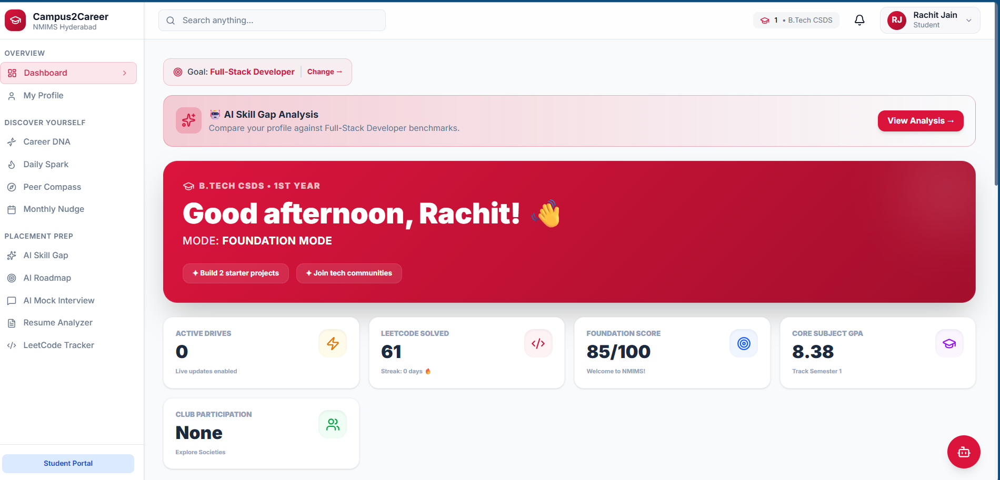
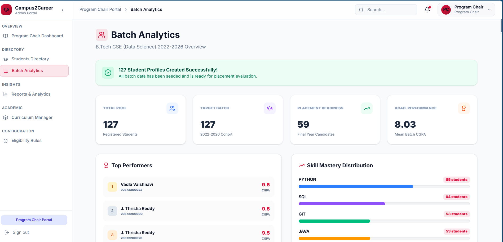

# Campus2Career — Virtual Placement Assistant

> An AI-powered career guidance and placement management platform for students transitioning from campus to professional careers.


---

## Screenshots

| Student Portal | Admin Portal | AI Career Advisor |
|:-:|:-:|:-:|
|  |  |  |

> **Note:** Add screenshots to `docs/screenshots/` to populate the table above.

---

## Overview

**Campus2Career** is a dual-portal platform built for NMIMS Hyderabad that combines personalized AI-driven career guidance for students with a comprehensive placement management system for administrators.

- **Student Portal** — Career discovery, skill gap analysis, LeetCode tracking, AI interview simulator, resume analysis, and personalized roadmap generation
- **Admin Portal** — Role-based dashboards for Deans, Directors, Program Chairs, Faculty, and Placement Officers with batch analytics, company/drive tracking, and full audit logs

---

## Features

### Student Portal
- **AI Career Advisor** — Real-time chat via OpenRouter (Gemini 2.0 Flash, Claude 3.5 Haiku, Llama 3.1 70B) for career assessments and guidance
- **Skill Gap Analysis** — Compares student profiles against 6 industry benchmarks (Full-Stack, AI/ML, DevOps, etc.)
- **AI Interview Simulator** — Voice-enabled practice interviews with AI-generated technical and behavioral questions
- **Resume Analyzer** — ATS scoring and optimization using a Python NLP engine (TF-IDF + cosine similarity)
- **Personalized Roadmaps** — 4-year prioritized action plans mapped to academic milestones
- **Study Kit Generation** — Notes with theoretical foundations, algorithms, and academic references (IEEE, ACM)
- **Syllabus-Driven Learning** — Upload syllabus PDFs to auto-generate learning roadmaps

### Admin Portal
- **RBAC** — 6 distinct role portals with scoped permissions and views
- **Batch Analytics** — Placement readiness, skill distributions, and eligibility metrics
- **Placement Management** — End-to-end tracking of companies, drives, interviews, and offers
- **Audit Logs** — Full administrative action history with filtering and export

---

## Tech Stack

| Layer | Technologies |
|---|---|
| **Frontend** | React 19, TypeScript, Vite 6, Tailwind CSS 4, Recharts, Lucide React, Monaco Editor |
| **Database / Auth** | Supabase PostgreSQL, Supabase Auth, Supabase Storage |
| **AI / NLP Engine** | Python FastAPI, OpenRouter API (Gemini 2.0 Flash, Claude 3.5 Haiku, Llama 3.1 70B), scikit-learn |
| **Monitoring** | Sentry (error tracking), PostHog (product analytics) |
| **Hosting** | Firebase Hosting (frontend), Railway / Render (AI engine) |

---

## Getting Started

### Prerequisites

- Node.js 18+
- Python 3.10+ *(for AI Engine)*
- Git

### 1. Clone & Install

```bash
git clone https://github.com/Rachit-Jain-24/Campus2Career.git
cd Campus2Career

npm install
```

### 2. Environment Variables

```bash
cp .env.example .env
```

Edit `.env` with your credentials:

| Variable | Required | Description |
|---|---|---|
| `VITE_SUPABASE_URL` | Yes | Supabase project URL |
| `VITE_SUPABASE_ANON_KEY` | Yes | Supabase public anon key |
| `VITE_AI_BACKEND_URL` | Yes (prod) | URL of the Python AI Engine |
| `VITE_JUDGE0_API_KEY` | No | Judge0 code execution key |
| `VITE_SENTRY_DSN` | No | Sentry error tracking DSN |
| `VITE_POSTHOG_API_KEY` | No | PostHog analytics key |

> **Server-side only** (set in Railway/Render dashboard, never in `.env`):
> `OPENROUTER_API_KEY`, `ONECOMPILER_API_KEY`

### 3. Start Development Server

```bash
npm run dev   # http://localhost:5173
```

### 4. AI Engine Setup *(optional — required for AI features)*

```bash
cd ai-engine

# Windows
python -m venv venv && venv\Scripts\activate

# macOS / Linux
python -m venv venv && source venv/bin/activate

pip install -r requirements.txt
python main.py   # http://localhost:8000
```

### 5. Build for Production

```bash
npm run build
```

---

## Portals & Access

| Portal | Route |
|---|---|
| Student Login | `/login` |
| Portal Selector | `/portal` |
| Admin | `/login/admin` |
| Dean | `/login/dean` |
| Director | `/login/director` |
| Program Chair | `/login/program-chair` |
| Faculty | `/login/faculty` |
| Placement Officer | `/login/placement-officer` |

---

## Project Structure

```
Campus2Career/
├── src/                      # Frontend source (React + TypeScript)
│   ├── components/           # Reusable UI components
│   │   ├── admin/            # Admin portal components
│   │   ├── interview/        # Interview simulator UI
│   │   ├── AICareerAdvisor/  # AI chatbot widget
│   │   └── ui/               # Base UI primitives
│   ├── pages/                # Route pages (student, admin, auth)
│   ├── lib/                  # Core logic and integrations
│   │   ├── ai/               # AI services (chatbot, copilot, RAG)
│   │   ├── openRouter.ts     # OpenRouter proxy client
│   │   ├── supabase.ts       # Supabase client
│   │   ├── errorHandler.ts   # Centralized error handling
│   │   └── rateLimiter.ts    # Client-side rate limiting
│   ├── services/             # Data services layer
│   ├── contexts/             # React contexts (Auth, Toast)
│   ├── hooks/                # Custom React hooks
│   └── types/                # TypeScript type definitions
├── ai-engine/                # Python FastAPI AI/NLP service
├── public/                   # Static assets
├── scripts/                  # SQL reference migrations
└── .env.example              # Environment variable reference
```

---

## AI Architecture

All AI operations use a secure server-side proxy — API keys never reach the browser.

```
Browser  →  FastAPI AI Engine  →  OpenRouter API
              (key stays here)      Gemini 2.0 Flash
                                    Claude 3.5 Haiku
                                    Llama 3.1 70B
```

- In-memory IP-based rate limiting (30 req/min)
- Multi-model fallback chain for reliability
- RAG-powered chatbot with transparent citations
- Resume analysis via TF-IDF cosine similarity (scikit-learn)
- Code execution proxied through OneCompiler API

---

## Deployment

The frontend deploys to **Firebase Hosting** via GitHub Actions (`.github/workflows/deploy.yml`). The AI engine deploys to **Railway** or **Render**. All secrets are configured in the hosting dashboard — never committed to the repo.

---

## License

Developed for **NMIMS Hyderabad** — B.Tech CSE (Data Science), Semester 8.  
© 2025–2026 Rachit Jain, Prasad Kannawar, Venkatesh Mahindra.
